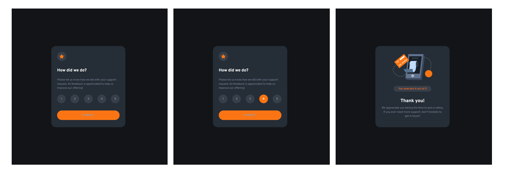

# Frontend Mentor - Interactive rating component solution

This is a solution to the [Interactive rating component challenge on Frontend Mentor](https://www.frontendmentor.io/challenges/interactive-rating-component-koxpeBUmI).

## Table of contents

- [Overview](#overview)
  - [The challenge](#the-challenge)
  - [Screenshot](#screenshot)
  - [Links](#links)
- [My process](#my-process)
  - [Built with](#built-with)
  - [What I learned](#what-i-learned)
  - [Useful resources](#useful-resources)
- [Author](#author)

## Overview

### The challenge

Users should be able to:

- View the optimal layout for the app depending on their device's screen size
- See hover states for all interactive elements on the page
- Select and submit a number rating
- See the "Thank you" card state after submitting a rating

### Screenshot



### Links

- Solution URL: [get solution🌐](https://github.com/VikashMaurya10/interactive-rating-component-main)
- Live Site URL: [view🌐](https://vikashmaurya10.github.io/interactive-rating-component-main/)

## My process

### Built with

- Semantic HTML5 markup
- SCSS custom properties
- Flexbox
- CSS Grid
- Mobile-first workflow

### What I learned

In this task i learned more jQuery function. Also i looked how to get value of the html tag, add css properties and how to manipulate the inner-Html by using jQuery. I really liked jQuery and will use it going forward.

To see how you can add code snippets, see below:

```js
const getRating = (id) => {
  $(`${id}`).click(() => {
    const rates = $(`${id}`).html();
    $("#display-rates").html(rates);
  });
};
$("#submitBtn").click(() => {
  if ($("#display-rates").html() > 0) {
    $("#firstCard").toggle(() => {
      $("#firstCard").css("display", "none");
    });
    $("#secondCard").toggle(() => {
      $("#secondCard").css("display", "block");
    });
  } else {
    alert("First choose rating number!!");
  }
});
```

### Useful resources

- [@Figma](https://www.figma.com) - This helped me for measuring the actual design. I really liked this pattern and will use it going forward.
- [@stackoverflow](https://stackoverflow.com/questions/3337621/jquery-toggle-css) - This is an amazing article which helped me finally understand how to toggle css properties by using JQuery. I'd recommend it to anyone still learning this concept.

## Author

- Frontend Mentor - [@vikashmaurya](https://www.frontendmentor.io/profile/VikashMaurya10)
- LinkedIn - [@in-vikashmaurya](https://www.linkedin.com/in/in-vikashmaurya)
